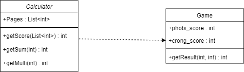
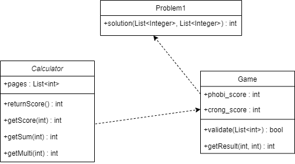
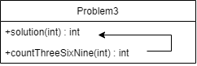
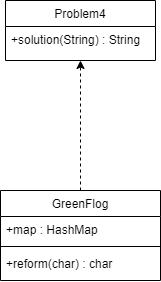
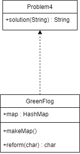

# 미션 진행 과정 기록

### 공부하기 시작한 기본서
- 우테코 설명회에서 포비님의 조언을 듣고 Java 기본서를 한 권 구입했다.
- 책도 스스로 골라봐야 안목이 생긴다고 말씀하셨으니 일단 쉽고 가독성 좋은 것으로 한권...
- 공부 방법 계획
  - (기본) 앞에서 부터 차근차근 읽기
  - (활용) 미션 진행하며 필요한 부분 발췌 읽기

[혼공자바](https://hongong.hanbit.co.kr/%EC%9E%90%EB%B0%94/)

## 문제 풀이 과정
주 언어 파이썬으로 개발해와서 이번 프리코스를 통해 자바라는 언어를 탐색해보는 기회가 될 것 같아 설렌다.
특히 객체지향프로그래밍(OOP)의 대장격 언어인 자바인 만큼, 객체지향성을 많이 고민해보며 진행해보겠다.
객체지향성 구현을 위해 고민하던 중 UML이라는 것을 알게 되었다.

[UML] : Unified Modeling Language 약자로, 통합 모델링 언어라고 불리운다.

이 UML을 통해 `클래스 다이어그램`을 그려보는 것이 객체지향성을 익히는데 많이 도움이 될 것 같았다!

<참고 블로그>
- [블로그1](https://medium.com/@smagid_allThings/uml-class-diagrams-tutorial-step-by-step-520fd83b300b)
- [블로그2](https: //velog.io/@khyunjiee/UML-Class-Diagram)

클래스 다이어그램을 그리는 tool로 https://app.diagrams.net/ 을 이용했다.

## 문제 1

### 기능 목록 v0.1

1. 입력값에 따라 점수 계산해주는 Class
    - Calculator

2. 점수를 비교해 최종 승자를 반환하는 Class
    - Game

### 기능 목록 v0.2

1. 자리 수 계산 로직 변경

각 자리수 계산을 할 때,
파이썬은 보통 String 변환 -> 인덱스 별로 가져옴 -> int(String[i])
위와 같은 방식으로 많이 활용해, java도 비슷하게 생각하고 구현했다.
하지만...
String.valueOf(int) 까지는 문제가 없었으나
String.CharAt(i) 여기서 문제가 발생했다.
CharAt은 ASCII 코드 및 Unicode 변환이 되어 해당 번호를 return한다...!
CharAt('9') = 57
그래서 계산 결과가 말도 안되게 나오는 것을 발견

Java는 자료형 변환을 최소화 해야 된다는 것을 또 깨달았다.

그리하여 10으로 나눈 몫과 나머지를 이용해 자릿수를 계산하는 로직으로 변경하였다.

2. Calculator 클래스에 returnScore 메소드를 추가 

- 합점수/곱점수를 구하는 로직 
  - getScore()
- 왼쪽/오른쪽 페이지 중 위 점수의 최대값을 선정하는 로직
  - returnScore()
을 분리하였다.

3. 예외사항 처리 로직 추가

그리고... Calculator 클래스를 완성 후 debugging 하던 중, 예외사항 처리 로직이 부족함을 깨달았다...!
다음부터 문제를 더 꼼꼼히 읽을 것을 다짐하며...

Game 클래스에 예외사항 처리를 위한 메소드를 추가한다.
Game 에서 예외사항이 아닌 것(정상 입력)에 대해서만 Calculator 클래스를 호출한다.

## 문제 3

### 기능 목록 v0.1

이 문제는 클래스를 나눌 필요가 없다는 생각이 들었다.
클래스를 꼭 나눠야 Java의 객체지향성을 잘 드러내는 것인지는 좀 더 고민이 필요해 보인다.

1. 1부터 주어진 숫자까지 for문으로 하나씩 int 값을 받아온다
2. 특정 int 값에 '3', '6', '9'가 들어 있는지 찾는 메소드를 정의한다
   - cnt 변수 선언
   - int -> String으로 변환
   - String의 각 char를 확인
   - 각각의 char에 3, 6, 9가 있는지 확인
   - 있으면 cnt값 1 증가
   - 전체 갯수를 return 해줌

## 문제 4

문제를 읽고 파이썬 dictionary 자료형이 떠올랐다. 청개구리 사전을 dict에 구현해 해당 key에 대한 value를 반환하는 방식으로 처리하면 되지 않을까.
Java에 dict 자료형이 있는지 찾아보니, 없고
대신 key-value값으로 이루어진 HashMap 자료 구조가 있다고 했다.

[스택오버플로우](https://stackoverflow.com/questions/1540673/java-equivalent-to-python-dictionaries)

기본서에 해당 내용을 찾아서 공부했고, 아래처럼 구현해보려고 한다.

### 기능 목록 v0.1

- GreenFlog 클래스
  - 필드
    - map(청개구리 사전)
  - 메소드
    - reform(char) -> 청개구리 사전 key: value 매핑
- solution 클래스
1. 문자열 길이만큼 for문 반복
2. for 문으로 인덱스의 char 뽑아오기
3. char가 알파벳이지 확인하기
   - 알파벳이면? reform 메소드
     - reform 된 것을 answer에 append
   - 아니면 넘어가기
     - 바꾸지 않은 것을 answer에 append
4. 최종값 answer return

### 기능 목록 v0.2

Java 클래스에 대한 이해가 많이 부족한가보다...
HashMap을 클래스 맴버 필드로 지정하고서 별도의 method 없이 map을 생성할 수 있을거라 생각했으나
생각해보니 map을 생성할 수 있는 별도 메소드가 필요햇다...!

- makeMap() 메소드 추가

