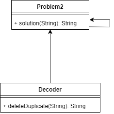
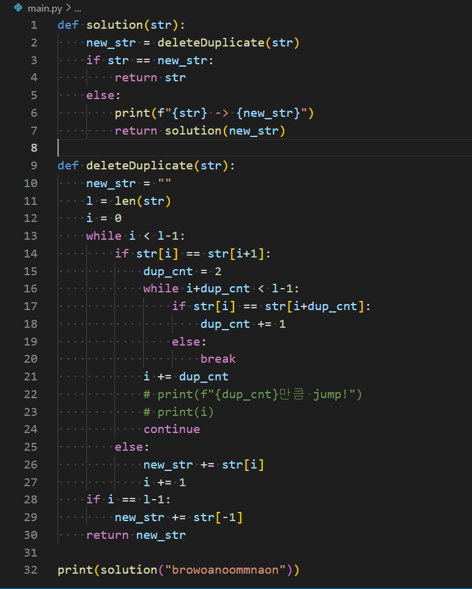
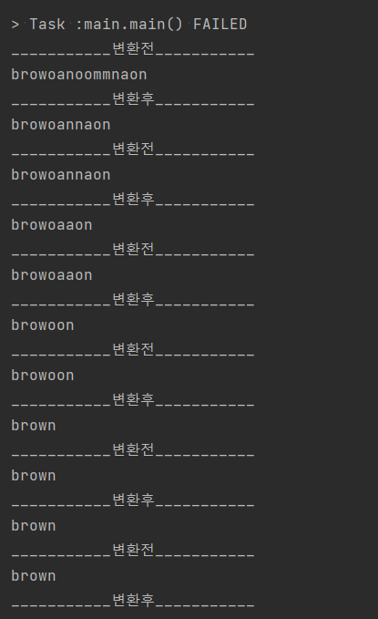
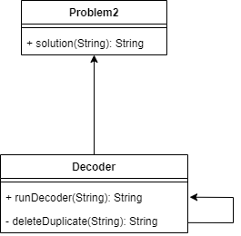
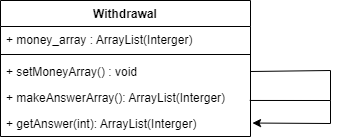
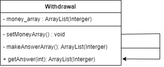

# 미션 진행 과정 기록

### 공부하기 시작한 기본서
- 우테코 설명회에서 포비님의 조언을 듣고 Java 기본서를 한 권 구입했다.
- 책도 스스로 골라봐야 안목이 생긴다고 말씀하셨으니 일단 쉽고 가독성 좋은 것으로 한권...
- 공부 방법 계획
  - (기본) 앞에서 부터 차근차근 읽기
  - (활용) 미션 진행하며 필요한 부분 발췌 읽기

[혼공자바](https://hongong.hanbit.co.kr/%EC%9E%90%EB%B0%94/)

## 문제 풀이 과정
주 언어 파이썬으로 개발해와서 이번 프리코스를 통해 자바라는 언어를 탐색해보는 기회가 될 것 같아 설렌다.
특히 객체지향프로그래밍(OOP)의 대장격 언어인 자바인 만큼, 객체지향성을 많이 고민해보며 진행해보겠다.
객체지향성 구현을 위해 고민하던 중 UML이라는 것을 알게 되었다.

[UML] : Unified Modeling Language 약자로, 통합 모델링 언어라고 불리운다.

이 UML을 통해 `클래스 다이어그램`을 그려보는 것이 객체지향성을 익히는데 많이 도움이 될 것 같았다!

<참고 블로그>
- [블로그1](https://medium.com/@smagid_allThings/uml-class-diagrams-tutorial-step-by-step-520fd83b300b)
- [블로그2](https: //velog.io/@khyunjiee/UML-Class-Diagram)

클래스 다이어그램을 그리는 tool로 https://app.diagrams.net/ 을 이용했다.

## 문제 1

### 기능 목록 v0.1

1. 입력값에 따라 점수 계산해주는 Class
    - Calculator

2. 점수를 비교해 최종 승자를 반환하는 Class
    - Game

### 기능 목록 v0.2

1. 자리 수 계산 로직 변경

각 자리수 계산을 할 때,
파이썬은 보통 String 변환 -> 인덱스 별로 가져옴 -> int(String[i])
위와 같은 방식으로 많이 활용해, java도 비슷하게 생각하고 구현했다.
하지만...
String.valueOf(int) 까지는 문제가 없었으나
String.CharAt(i) 여기서 문제가 발생했다.
CharAt은 ASCII 코드 및 Unicode 변환이 되어 해당 번호를 return한다...!
CharAt('9') = 57
그래서 계산 결과가 말도 안되게 나오는 것을 발견

Java는 자료형 변환을 최소화 해야 된다는 것을 또 깨달았다.

그리하여 10으로 나눈 몫과 나머지를 이용해 자릿수를 계산하는 로직으로 변경하였다.

2. Calculator 클래스에 returnScore 메소드를 추가 

- 합점수/곱점수를 구하는 로직 
  - getScore()
- 왼쪽/오른쪽 페이지 중 위 점수의 최대값을 선정하는 로직
  - returnScore()
을 분리하였다.

3. 예외사항 처리 로직 추가

그리고... Calculator 클래스를 완성 후 debugging 하던 중, 예외사항 처리 로직이 부족함을 깨달았다...!
다음부터 문제를 더 꼼꼼히 읽을 것을 다짐하며...

Game 클래스에 예외사항 처리를 위한 메소드를 추가한다.
Game 에서 예외사항이 아닌 것(정상 입력)에 대해서만 Calculator 클래스를 호출한다.

## 문제 2

### 기능 목록 v0.1

- 문제 구조는 간단해 UML을 작성하는 건 쉬웠다.
  - 중복 제거하는 메소드 정의
  - 재귀적으로 호출해 중복이 없을 때까지 반복
  - 중복 제거 전 후가 똑같으면 원래값 return

중복을 삭제하는 부분의 메소드에 대한 알고리즘을 짜는 것이 쉽지 않다.
어렵지 않은 문제 같은데, Java 구현이 잘 안된다...
문제 5번까지 풀고 다시 돌아와서 도전했지만 또 막힘...
우선 Python으로 구현해보았다.

- deleteDuplicate 부분을 Java로 옮기는 것이 관건...
- Java String끼리 더하기 방법 + String 인덱싱을 어떻게 처리하는지 찾아본 후 아래처럼 작성해보았다.

### 기능 목록 v0.2

- String 인덱싱 -> String.charAt()
- String + char 덧셈 가능 -> new_str += str.charAt(i)

그런데... 잘 구현된 것 같은데 오류가 난다...
이러지마 제발...

- 그러다 기본서에서 공부한 것을 깨달았다...
- str == n_str 재귀 만료 부분이 잘못되었다는 사실...
  - Java는 String이 참조 객체이기 때문에 참조 객체의 주소가 일치하는 여부를 알려주는 연산자가 "==" 였던 것
  - str.equal(n_str)으로 해야 "값"이 같은지를 확인할 수 있다.
- 또한, 재귀함수를 solution에서 돌리는 것보다 Decoder 클래스에서 돌리는게 더 낫다고 판단
  - renDecoder 메소드 추가 및 deleteDuplicate 메소드 private 설정 변경
- 그렇게 수정해서 완성된 구조

### 기능 목록 v0.3

응 아직 끝 아니야... 이번엔 test에서 오류가 또 났다...
테스트 로그를 살펴본 결과, testcase2에서 문제가 있었는데
return 값을 프린트해보며 debugging 해본 결과...

1. "" 빈 String이 들어왔을 때 charAt으로 인덱싱 처리를 하는데서 오류가 발생
    - deleteDuplicate 메소드에 빈 String이 들어왔을 때 바로 return 시키는 로직 추가
2. 중복되는 값이 2개 이상 있는지 확인하는 "while ( i + dup_cnt < l )" while 문에서 indexing 에러 발생
    - "while ( i + dup_cnt < l - 1)" 중복을 세는 범위를 1만큼 줄여줘서 String의 index 밖으로 벗어나지 않게 조정

## 문제 3

### 기능 목록 v0.1

이 문제는 클래스를 나눌 필요가 없다는 생각이 들었다.
클래스를 꼭 나눠야 Java의 객체지향성을 잘 드러내는 것인지는 좀 더 고민이 필요해 보인다.

1. 1부터 주어진 숫자까지 for문으로 하나씩 int 값을 받아온다
2. 특정 int 값에 '3', '6', '9'가 들어 있는지 찾는 메소드를 정의한다
   - cnt 변수 선언
   - int -> String으로 변환
   - String의 각 char를 확인
   - 각각의 char에 3, 6, 9가 있는지 확인
   - 있으면 cnt값 1 증가
   - 전체 갯수를 return 해줌

## 문제 4

문제를 읽고 파이썬 dictionary 자료형이 떠올랐다. 청개구리 사전을 dict에 구현해 해당 key에 대한 value를 반환하는 방식으로 처리하면 되지 않을까.
Java에 dict 자료형이 있는지 찾아보니, 없고
대신 key-value값으로 이루어진 HashMap 자료 구조가 있다고 했다.

[스택오버플로우](https://stackoverflow.com/questions/1540673/java-equivalent-to-python-dictionaries)

기본서에 해당 내용을 찾아서 공부했고, 아래처럼 구현해보려고 한다.

### 기능 목록 v0.1

- GreenFlog 클래스
  - 필드
    - map(청개구리 사전)
  - 메소드
    - reform(char) -> 청개구리 사전 key: value 매핑
- solution 클래스
1. 문자열 길이만큼 for문 반복
2. for 문으로 인덱스의 char 뽑아오기
3. char가 알파벳이지 확인하기
   - 알파벳이면? reform 메소드
     - reform 된 것을 answer에 append
   - 아니면 넘어가기
     - 바꾸지 않은 것을 answer에 append
4. 최종값 answer return

### 기능 목록 v0.2

Java 클래스에 대한 이해가 많이 부족한가보다...
HashMap을 클래스 맴버 필드로 지정하고서 별도의 method 없이 map을 생성할 수 있을거라 생각했으나
생각해보니 map을 생성할 수 있는 별도 메소드가 필요햇다...!

- makeMap() 메소드 추가

## 문제 5

- 알고리즘
그리디 알고리즘의 전형적인 예시로 비슷한 문제를 풀어본 적이 있다.
큰 금액의 화폐로 최대한 채우고 나머지가 큰 금액 화폐보다 작아지면 다시 그 것보다 하나 작은 금액 화폐로 채우고를 반복하는 방식

- Java 문법
List 컬렉션 중 ArrayList를 자료구조로 활용해야겠다고 생각했다.

### 기능 목록 v0.1

- [50000, 10000, 5000, 1000, 500, 100, 50, 10, 1] 금액이 담긴 ArrayList를 하나 만든다 - money_array
- [0, 0, 0, 0, 0, 0, 0, 0, 0] 모두 0이 담긴 ArrayList를 return 형식으로 지정한다. - answer_array
- money에 대하여 money_array index에 해당하는 '값'으로 나눈 몫을 answer_array에 같은 index에 저장한다.
- money를 나머지로 다시 할당한다.
- 위 과정을 1의 자리까지 반복한다.

### 기능 목록 v0.2

- 구현을 하다보니 모든 필드와 메소드를 default로 설정하면 패키지 내에서 충돌이 발생할 수 있겠다는 생각이 들었다.
- 충돌 가능성 이유
  - money_array는 setMoneyArray 메서드가 실행되기 전에는 무의미한 빈 값이다.
  - getAnswer을 하기 전에 makeAnswerArray를 선행해서 실행해야 한다.
- 이를 위해 접근 제한자를 private으로 설정해 '캡슐화'하여 외부에서는 getAnswer 메서드만 활용할 수 있게 변경했다.

### 기능 목록 v0.3

- List.of 메소드가 Java9부터 지원 가능하다는 것을 알게 되었다.
    - [[10분 테코톡] 호호의 Java 11](https://youtu.be/LcIyHlE2NlA)
    - ImmutableList인 만큼 money_array를 만들 때 활용해봐야겠다.
    - IntelliJ에 TODO 기능을 제공해주는 것이 있다!
      - [TODO comments](https://www.jetbrains.com/help/idea/using-todo.html#add-multiline-todo)
      - TODO 적어놓기 우선

## 문제 6

- 해당 문제는 class diagram이 간단하고, 오히려 각 메소드별 로직에 더 집중해야 될 것 같아 '알고리즘'에 집중하려고한다.
  - (class diagram은 생략)

### 기능 목록 v0.1

1. 조건 분석
  - 두 글자 이상의 문자가 연속적으로 순서에 맞추어 포함되어 있는 경우 중복으로 간주
    - **각 닉네임을 두글자씩 묶어서 잘라서 중복을 비교한다. (Bigram)**
      - 세 글자, 네 글자 등등 같아도 두글자부터 같아야 되니 위 경우에 모두 포함 됨
    - String.substring() 메소드 활용
      - "제이엠" -> ["제이", "이엠"] 두개씩 있는 ArrayList 생성
    - bigrams ArrayList를 다시 ArrayList에 넣어서 최종적으로 다음 형태의 자료 생성
      - [[제이, 이엠], [제이, 이슨], [워니], [엠제, 제이], [이제, 제엠]]
  - 크루는 1명 이상 10,000명 이하
    - 크루의 수가 적지 않으므로, 최대한 중복을 피하도록 알고리즘 설계 필요
      - 중복이 확인된 index는 다시 확인하지 않도록, forms size의 boolean array 정의
      - forms, size(5) -> 초기값: [false, false, false, false, false]

2. 코드 구현
  - 이중 for문을 돌면서 하나의 bigram이 bigrams ArrayList에 들어 있는지 확인
    - 중복 확인된 index 자료는 제외
    - ex. [제이, 이슨].contains("제이")
      - 들어 있으면 boolean array값 true로 변경
        - 자기 자신도 true로 변경 주의!
      - [true, true, false, false, false]
  - 최종적으로 boolean array가 true인 index의 이메일 주소만 반환
  - 이메일 주소 sorting하기
    - Collections.sort()

## 문제 7

대망의 7번 문제. 이건 내가 만들고 있는 사이트에서도 활용하면 좋을 알고리즘 같다. 가장 기초적인 친구 추천 알고리즘으로.

### 기능 목록 v0.1

1. 자료 구조
- {mrko=0, andole=2, ...} 사용자 id와 추천 점수가 연결된 HashMap<String, Integer> "user_score"
  - friends 및 visitors에 대한 모든 사용자 id가 키값에 들어가야 함
- {mrko=[aldole, donut], andole=[donut, shakevan], ...} 사용자 id와 친구 List가 연결된 HashMap<String, ArrayList<String>> "user_friends"

2. 알고리즘

setUserScore
- friends를 looping 돌 떄
  - user_score의 key값 모두 추가 밑 0으로 초기화
- visitors를 looping 돌며 user_score의 key값 추가 밑 0으로 초기화
 
setUserFriends
- user_score를 이용해 key값에 대한 기본 빈 리스트를 생성
- friends를 looping 돌 며 key-value 서로 추가
  -  key: "donut", value += "andole" // key: "andole", value += "dunut"

getFriendScore
- key: user에 해당하는 user_friends ArrayList value 반환
- value를 루핑돌며 해당 value를 key로 갖는 value로 가서 현재 친구가 아닌 user 조회
  - 현재 친구가 아닌 user의 user_score +10 추가

getVisitScore
- visitors 루핑 돌며 user_score 해당 key에 value +1 추가

getResult
- result List<String> result선언
- user_score value 순으로 정렬
  - 다시 name 순으로 다중 정렬
- for 문 돌며 상위 5명 result에 추가
  - value가 0이면 for문 break;

3. 피드백

- `Done is better than perfect` 모토로 일단 구현에 집중하였다.
- looping이 너무 많이 이뤄지는 문제점
- 중복되는 로직이 많다... 리팩토링이 절실하다...
- Java에 있는 built-in function들을 잘 몰라서 비효율적으로 로직을 구현하는 느낌...
- 자료 구조를 더 적게 사용할 수는 없을지...

### 기능 목록 v0.2

오류가 있어 getResult 메소드를 많이 수정했다.

getResult
- user_score name 순으로 먼저 정렬한다.
    - 다시 value 순으로 다시 정렬한다.
    - `stable sort` 이미로 값이 같은 경우는 name 순 정렬이 유지된다.
- user_friends에 user를 key값으로 하여 친구 목록을 구한다.
  - 친구 목록에 있는 사용자는 user_score에서 제거한다.
- for 문 돌며 상위 5명 result에 추가할 때
  - looping이 전체 user_score size보다 같거나 작을때까지만 한다.